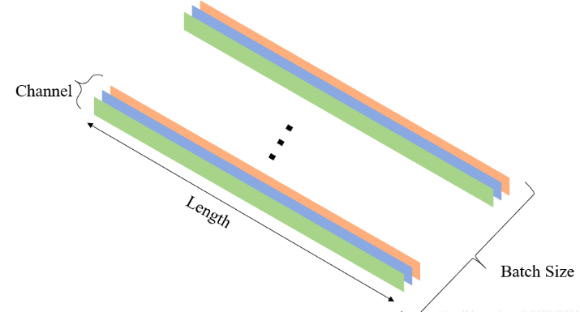
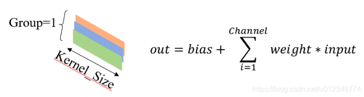
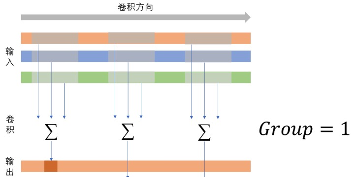
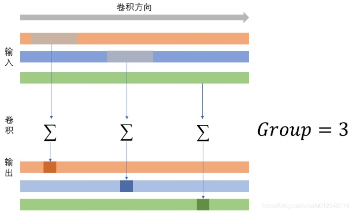

# 1/2/3d CNN

## Conv1d, Conv2d and Conv3d
本节的主要内容就是一边看文档，一边用代码验证。在PyTorch中，分别在`torch.nn`和`torch.nn.functional`两个模块都有conv1d，conv2d和conv3d；从计算过程来说，
两者本身没有太大区别；但是`torch.nn`下的都是layer，conv的参数都是经过训练得到；`torch.nn.functional`下的都是函数，其参数可以人为设置。本文在分析时，两者
的文档一起看，但是实验主要以`torch.nn.functional`为主，更加方便修改。
### Conv1d
``` torch.nn.functional.conv1d(input, weight, bias=None, stride=1, padding=0, dilation=1, groups=1)  ```
`input`  
input是一维输入，其形状为```(Batch_Size,In_Channel,Length)```；```Batch_Size```是训练批量的大小；```In_Channel```是输入的通道数量；```Length```是输入的长度，因为是一维输入，
所以其只有长度。下图展示了一个一维输入，其包括3个通道：input如图所示  
  
 `weight`
 weight是一维卷积核，其形状为```(Out_Channel,In_Channel/Group,Kernel_Size)```；```Out_Channel```是输出的通道数量；```In_Channel/Group```
 的目的是决定每一层的输出是如何由输入组成的，后续会详细介绍，此处不妨设```Group=1```；```Kernel_Size```是一维卷积核的大小。下图展示了一个一维卷
 积核和其对应的累加方式：  
  
`group`
group我觉得应该属于卷机核的一个重要参数，从我们较为熟悉的2dcnn来说，group可以理解为filter的数量，在此rep中，我们使用一组图像来理解1dcnn中的group参数  

  
`stride and padding`  
stride理解起来还是很容易；当stride=1时，卷积核在原始输入上以步长为1进行移动.stride理解起来还是很容易；当stride=1时，卷积核在原始输入上以步长为1进行移动.  
`dilation`  
```dilation```，按照我的理解就是带孔卷积，其控制输入层上的取样间隔，当dilation=1时，就是前文所示的卷积。下图展示了一个dilation=2的情形，不难发现，这个参数能够
在不增强计算量的前提下增大感受野。
  
### Conv2d and Conv3d
原则上讲，如果看文档，会发现conv2d、conv3d和conv1d并没有太大的区别，只不过在维度上有所区别。因此，我也就不分开介绍，
直接放在一起。不难发现，唯一的区别在于维度的上升；因此为weights的定义也有所不同，分别是`(Out_Channels, In_channels/Groups,kH,kW)`
和`(Out_Channels, In_channels/Groups，kT,kH,kW)`。并且，conv2d和3d还是存在一定的不同  
* `conv3d`除了可以在图像平面上移动卷积之外，还可以在深度方向进行卷积；而`conv2d`并没有这个能力。 
* `conv3d`中的深度和`conv2d`中的Channel是不对应的，`conv3d`中的每一个深度上都可以对应多个Channel，因此深度和Channel是不同的概念

### Pytorch of 1、2 and 3d cnn
1. conv1d
```
"""
1d cnn
"""
def cnn_1d():
    Batch_Size = 1
    In_Channel = 2
    Length = 7
    Out_Channel = 2
    Group = 1
    Kernel_Size = 3
    Padding = 1
    Dilation = 1

    one = torch.rand(Batch_Size, In_Channel, Length)
    print('one', one)
    print('shape of one', one.shape)
    # 定义了两个Kernel
    # 第一个Kernel取第一个Channel中间那个值
    # 第二个Kernel将第一个Channel与第二个Channel相减
    filter = torch.zeros(Out_Channel, int(In_Channel / Group), Kernel_Size)
    filter[0][0][1] = 1
    filter[1][0][1] = 1
    filter[1][1][1] = -1
    print("!!!!!!!!!!!!!!!!!!!!!!")
    print("filter shape is (out_channel, in channel/group, kernel size):", filter.shape)

    print( "filter is :", filter)
    print("!!!!!!!!!!!!!!!!!!!!!!")
    result = F.conv1d(one, filter, padding=Padding, groups=Group, dilation=Dilation)
    print('result', result)
    print('shape of results', result.shape) 
```
  
2. 2D CNN
```
def cnn_2d():
    Batch_Size = 1
    In_Channel = 2
    Height = 5
    Width = 5
    Out_Channel = 2
    Group = 1
    Kernel_Size_H = 3
    Kernel_Size_W = 3
    Padding = 1
    Dilation = 1

    # 定义了两个Kernel
    # 第一个Kernel取第一个Channel左上角的值
    # 第二个Kernel取第二个Channel右下角的值
    two = torch.rand(Batch_Size, In_Channel, Height, Width)
    print('two', two)
    print('shape of two',two.shape)

    filter = torch.zeros(Out_Channel, int(In_Channel / Group), Kernel_Size_H, Kernel_Size_W)
    filter[0][0][0][0] = 1
    filter[1][1][2][2] = 1

    print("!!!!!!!!!!!!!!!!!!!!!!")
    print("filter shape is (out_channel, in channel/group, kernel size):", filter.shape)

    print("filter is :", filter)
    print("!!!!!!!!!!!!!!!!!!!!!!")

    depth = F.conv2d(two, filter, padding=Padding)
    print(depth.shape)
    print(depth)
```
  
3. 3d CNN
```
def cnn_3d():
    Batch_Size = 1
    In_Channel = 2
    Height = 5
    Width = 5
    Depth = 5
    Out_Channel = 2
    Group = 1
    Kernel_Size_D = 3
    Kernel_Size_H = 3
    Kernel_Size_W = 3
    Padding = 1
    Dilation = 1

    # 定义了两个Kernel
    # 第一个Kernel取第一个深度，左上角的值
    # 第二个Kernel啥也不做
    thr = torch.rand(Batch_Size, In_Channel, Depth, Height, Width)
    print("three",thr)
    print("shape of three", thr.shape)
    filter = torch.zeros(Out_Channel, int(In_Channel / Group), Kernel_Size_D, Kernel_Size_H, Kernel_Size_W)

    print("!!!!!!!!!!!!!!!!!!!!!!")
    print("filter shape is (out_channel, in channel/group, kernel size of deep, kernel size of height, kernel size of weight):",
          filter.shape)

    print("filter is :", filter)
    print("!!!!!!!!!!!!!!!!!!!!!!")

    filter[0][0][0][0][0] = 1
    result = torch.conv3d(thr, filter, padding=1)
    print("shape of result", result.shape)
    print(result)
```  
```
three tensor([[[[[0.9378, 0.7143, 0.0164, 0.7399, 0.2340],
           [0.3602, 0.4609, 0.1119, 0.6817, 0.1616],
           [0.2681, 0.7236, 0.9993, 0.9933, 0.6711],
           [0.1691, 0.2189, 0.9419, 0.3747, 0.1432],
           [0.5545, 0.3117, 0.8997, 0.7590, 0.8257]],

          [[0.2700, 0.8964, 0.7351, 0.1901, 0.1579],
           [0.9250, 0.5113, 0.1256, 0.1359, 0.5819],
           [0.9164, 0.0661, 0.4638, 0.2034, 0.8805],
           [0.3558, 0.0575, 0.7226, 0.7914, 0.7750],
           [0.0739, 0.9107, 0.6245, 0.2151, 0.6017]],

          [[0.0974, 0.0550, 0.5221, 0.4385, 0.3259],
           [0.7794, 0.4792, 0.3487, 0.6607, 0.6441],
           [0.6267, 0.0212, 0.8685, 0.6426, 0.6202],
           [0.4445, 0.4314, 0.0136, 0.8376, 0.8123],
           [0.4711, 0.7165, 0.4292, 0.0570, 0.3200]],

          [[0.0755, 0.3564, 0.8105, 0.2584, 0.4878],
           [0.9038, 0.8363, 0.8470, 0.1739, 0.0821],
           [0.0612, 0.4731, 0.6809, 0.2698, 0.7268],
           [0.3234, 0.0263, 0.5353, 0.8058, 0.6037],
           [0.9581, 0.8383, 0.1580, 0.0044, 0.4539]],

          [[0.7584, 0.3007, 0.5660, 0.1686, 0.7930],
           [0.4736, 0.5964, 0.7071, 0.7900, 0.2021],
           [0.8815, 0.6751, 0.4767, 0.5664, 0.2210],
           [0.1578, 0.3675, 0.2765, 0.1981, 0.9440],
           [0.9853, 0.2005, 0.8558, 0.2611, 0.8306]]],


         [[[0.9707, 0.9639, 0.3091, 0.4427, 0.1842],
           [0.2343, 0.1809, 0.6508, 0.5846, 0.7821],
           [0.6484, 0.6107, 0.3366, 0.5240, 0.2723],
           [0.2504, 0.0555, 0.6511, 0.8225, 0.2493],
           [0.7113, 0.6555, 0.8318, 0.3639, 0.8775]],

          [[0.4058, 0.9096, 0.9543, 0.2027, 0.8207],
           [0.0897, 0.4703, 0.8236, 0.3435, 0.9044],
           [0.7055, 0.4595, 0.2182, 0.3985, 0.8979],
           [0.3695, 0.6542, 0.0134, 0.1113, 0.0288],
           [0.2213, 0.6709, 0.8971, 0.8824, 0.3800]],

          [[0.0219, 0.8354, 0.8148, 0.3485, 0.2507],
           [0.7174, 0.5726, 0.5359, 0.6337, 0.8029],
           [0.1306, 0.9222, 0.0349, 0.8848, 0.8740],
           [0.6600, 0.5153, 0.8967, 0.0783, 0.5648],
           [0.5561, 0.6694, 0.5524, 0.3923, 0.5011]],

          [[0.9164, 0.7262, 0.8183, 0.5019, 0.6713],
           [0.3091, 0.8920, 0.5777, 0.8182, 0.9111],
           [0.0589, 0.1233, 0.6049, 0.1671, 0.5983],
           [0.3464, 0.8833, 0.1923, 0.8329, 0.9573],
           [0.9617, 0.5911, 0.7462, 0.5687, 0.3166]],

          [[0.6124, 0.8880, 0.9317, 0.5045, 0.1135],
           [0.6241, 0.3127, 0.3477, 0.2033, 0.4201],
           [0.4785, 0.3261, 0.7893, 0.4301, 0.1537],
           [0.3404, 0.9073, 0.7035, 0.6580, 0.8549],
           [0.5508, 0.0463, 0.0743, 0.3397, 0.3599]]]]])
shape of three torch.Size([1, 2, 5, 5, 5])
!!!!!!!!!!!!!!!!!!!!!!
filter shape is (out_channel, in channel/group, kernel size of deep, kernel size of height, kernel size of weight): torch.Size([2, 2, 3, 3, 3])
filter is : tensor([[[[[0., 0., 0.],
           [0., 0., 0.],
           [0., 0., 0.]],

          [[0., 0., 0.],
           [0., 0., 0.],
           [0., 0., 0.]],

          [[0., 0., 0.],
           [0., 0., 0.],
           [0., 0., 0.]]],


         [[[0., 0., 0.],
           [0., 0., 0.],
           [0., 0., 0.]],

          [[0., 0., 0.],
           [0., 0., 0.],
           [0., 0., 0.]],

          [[0., 0., 0.],
           [0., 0., 0.],
           [0., 0., 0.]]]],


        [[[[0., 0., 0.],
           [0., 0., 0.],
           [0., 0., 0.]],

          [[0., 0., 0.],
           [0., 0., 0.],
           [0., 0., 0.]],

          [[0., 0., 0.],
           [0., 0., 0.],
           [0., 0., 0.]]],


         [[[0., 0., 0.],
           [0., 0., 0.],
           [0., 0., 0.]],

          [[0., 0., 0.],
           [0., 0., 0.],
           [0., 0., 0.]],

          [[0., 0., 0.],
           [0., 0., 0.],
           [0., 0., 0.]]]]])
!!!!!!!!!!!!!!!!!!!!!!
shape of result torch.Size([1, 2, 5, 5, 5])
tensor([[[[[0.0000, 0.0000, 0.0000, 0.0000, 0.0000],
           [0.0000, 0.0000, 0.0000, 0.0000, 0.0000],
           [0.0000, 0.0000, 0.0000, 0.0000, 0.0000],
           [0.0000, 0.0000, 0.0000, 0.0000, 0.0000],
           [0.0000, 0.0000, 0.0000, 0.0000, 0.0000]],

          [[0.0000, 0.0000, 0.0000, 0.0000, 0.0000],
           [0.0000, 0.9378, 0.7143, 0.0164, 0.7399],
           [0.0000, 0.3602, 0.4609, 0.1119, 0.6817],
           [0.0000, 0.2681, 0.7236, 0.9993, 0.9933],
           [0.0000, 0.1691, 0.2189, 0.9419, 0.3747]],

          [[0.0000, 0.0000, 0.0000, 0.0000, 0.0000],
           [0.0000, 0.2700, 0.8964, 0.7351, 0.1901],
           [0.0000, 0.9250, 0.5113, 0.1256, 0.1359],
           [0.0000, 0.9164, 0.0661, 0.4638, 0.2034],
           [0.0000, 0.3558, 0.0575, 0.7226, 0.7914]],

          [[0.0000, 0.0000, 0.0000, 0.0000, 0.0000],
           [0.0000, 0.0974, 0.0550, 0.5221, 0.4385],
           [0.0000, 0.7794, 0.4792, 0.3487, 0.6607],
           [0.0000, 0.6267, 0.0212, 0.8685, 0.6426],
           [0.0000, 0.4445, 0.4314, 0.0136, 0.8376]],

          [[0.0000, 0.0000, 0.0000, 0.0000, 0.0000],
           [0.0000, 0.0755, 0.3564, 0.8105, 0.2584],
           [0.0000, 0.9038, 0.8363, 0.8470, 0.1739],
           [0.0000, 0.0612, 0.4731, 0.6809, 0.2698],
           [0.0000, 0.3234, 0.0263, 0.5353, 0.8058]]],


         [[[0.0000, 0.0000, 0.0000, 0.0000, 0.0000],
           [0.0000, 0.0000, 0.0000, 0.0000, 0.0000],
           [0.0000, 0.0000, 0.0000, 0.0000, 0.0000],
           [0.0000, 0.0000, 0.0000, 0.0000, 0.0000],
           [0.0000, 0.0000, 0.0000, 0.0000, 0.0000]],

          [[0.0000, 0.0000, 0.0000, 0.0000, 0.0000],
           [0.0000, 0.0000, 0.0000, 0.0000, 0.0000],
           [0.0000, 0.0000, 0.0000, 0.0000, 0.0000],
           [0.0000, 0.0000, 0.0000, 0.0000, 0.0000],
           [0.0000, 0.0000, 0.0000, 0.0000, 0.0000]],

          [[0.0000, 0.0000, 0.0000, 0.0000, 0.0000],
           [0.0000, 0.0000, 0.0000, 0.0000, 0.0000],
           [0.0000, 0.0000, 0.0000, 0.0000, 0.0000],
           [0.0000, 0.0000, 0.0000, 0.0000, 0.0000],
           [0.0000, 0.0000, 0.0000, 0.0000, 0.0000]],

          [[0.0000, 0.0000, 0.0000, 0.0000, 0.0000],
           [0.0000, 0.0000, 0.0000, 0.0000, 0.0000],
           [0.0000, 0.0000, 0.0000, 0.0000, 0.0000],
           [0.0000, 0.0000, 0.0000, 0.0000, 0.0000],
           [0.0000, 0.0000, 0.0000, 0.0000, 0.0000]],

          [[0.0000, 0.0000, 0.0000, 0.0000, 0.0000],
           [0.0000, 0.0000, 0.0000, 0.0000, 0.0000],
           [0.0000, 0.0000, 0.0000, 0.0000, 0.0000],
           [0.0000, 0.0000, 0.0000, 0.0000, 0.0000],
           [0.0000, 0.0000, 0.0000, 0.0000, 0.0000]]]]])
```


