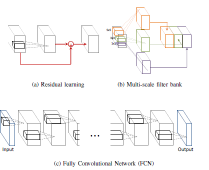
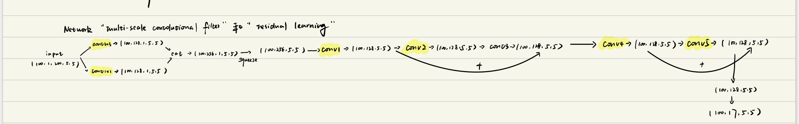
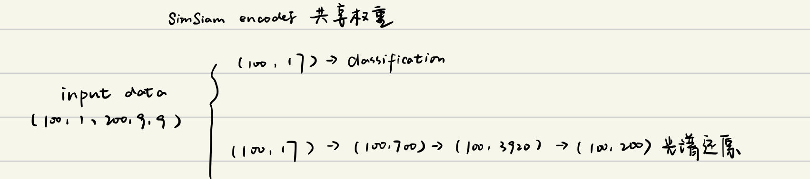
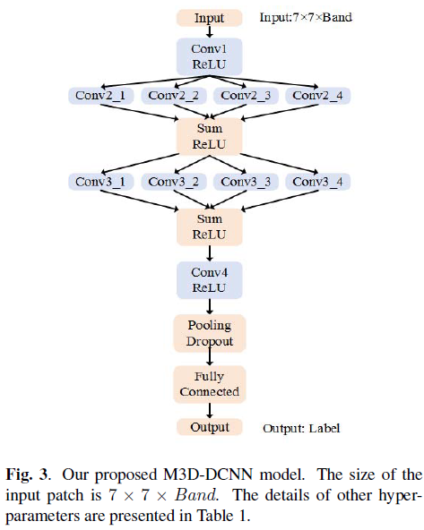

# Evolution of Hyperspectral

## Evolution of deep learning in Hyperspectral (2015~2018)
本节的主要内容是记录深度学习（CNN）的发展历程（从2015年记录至2018年），包含1d、2d、3d-CNN，以及supervised与semi-supervised的方法；本文档按照时间顺序来记录发展历程。

### 2015 年
· Deep Convolutional Neural Networks for Hyperspectral Image Classification（1d-cnn）  
早期的CNN的高光谱分类直接使用1dcnn处理光谱信息，忽视空间信息的重要新。  
  

### 2016 年
·Deep Feature Extraction and Classification of Hyperspectral Images Based on Convolutional Neural Networks（3d-cnn）  
2016年，开始使用3d卷积在空间方向与光谱方向进行卷积
  
同时，还提出了一些类似图象增强（image augmentation）的方法，文章称其为`changing Rodiation Based Virtual Sample` & `mixture-based Virtual Samples`  

·Going Deeper with Contextual CNN for Hyperspectral Image Classification  
2016年，随着凯明把resnet挂网arxiv，残差学习`resudual learning`开始风靡于深度学习。本文引入了残差快从而构建更加深入的卷积模型。同时，得益于maskrcnn等的发展，他们
还研究了`multi-scale`与`fully convolution network`.Contributions有由下图所示：
  
考虑到这么多contributions，以及都是沿用的较为新颖的方法，我认为这篇文章有一定的利用新颖方法搞噱头的存在 ，具体的`input tensor` 变化如图  

### 2017年
·A semi-supervised convolutional neural network for hyperspectral image classification （semi-supervised）
2017年，大家开始考虑使用伪标签来进行semi监督学习，本文提出了一个`autoencoder`结构，利用`embedding`监督学习分类信息，利用`decoder`结构还原光谱维度信息。
  
但是这篇文章考虑了semisupervised之后就没有去接着考虑空谱信息融合了。  

·MULTI-SCALE 3D DEEP CONVOLUTIONAL NEURAL NETWORK FOR HYPERSPECTRAL IMAGE CLASSIFICATION （多尺度）  
此时人们的发展方向仍然还是停留在多尺度、3d卷积的操作，具体如下图：  
  

