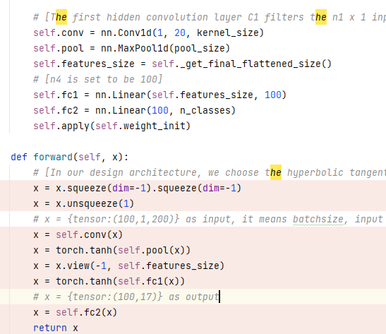
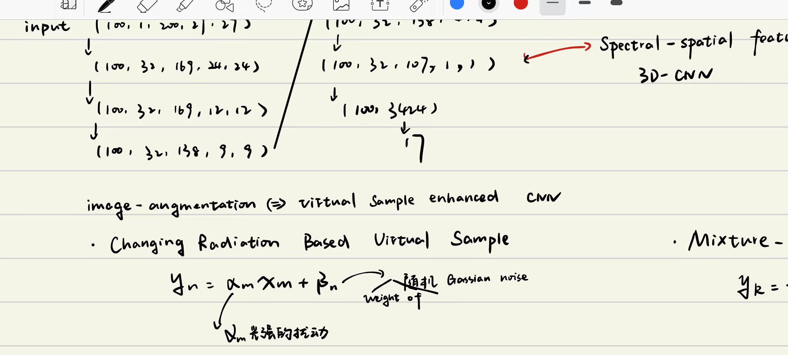

# Evolution of Hyperspectral

## Evolution of deep learning in Hyperspectral (2015~2018)
本节的主要内容是记录深度学习（CNN）的发展历程（从2015年记录至2018年），包含1d、2d、3d-CNN，以及supervised与semi-supervised的方法；本文档按照时间顺序来记录发展历程。

### 2015 年
· Deep Convolutional Neural Networks for Hyperspectral Image Classification（1d-cnn）  
早期的CNN的高光谱分类直接使用1dcnn处理光谱信息，忽视空间信息的重要新。  
  

### 2016 年
·Deep Feature Extraction and Classification of Hyperspectral Images Based on Convolutional Neural Networks（3d-cnn）  
2016年，开始使用3d卷积在空间方向与光谱方向进行卷积
  
同时，还提出了一些类似图象增强（image augmentation）的方法，文章称其为`changing Rodiation Based Virtual Sample` & `mixture-based Virtual Samples`  

·Going Deeper with Contextual CNN for Hyperspectral Image Classification  
2016年，随着凯明把resnet挂网arxiv，残差学习`resudual learning`开始风靡于深度学习。

